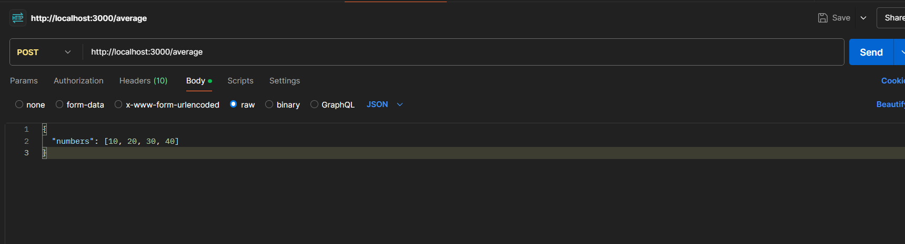
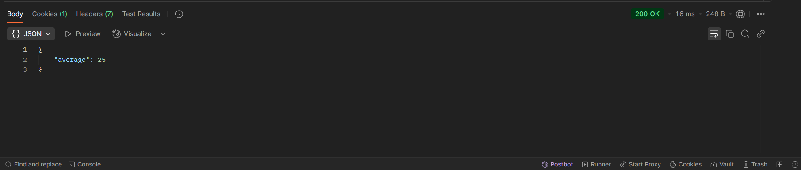

# Average Calculator API

This is a simple RESTful API built with **Node.js** and **Express**. It calculates the average of numbers sent in a POST request.
This project demonstrates basic server setup, routing, JSON handling, and input validation.

---

## 📁 Project Structure

    2315990039
    ---calculator_task_1
        ---backend
            --index.js
            --package.json
            --README.md
            --s1.png
            --s2.png

After reaching and making of **index.js**  i got the URL as **Server running on http://localhost:3000**.
After that i will check the API on POSTMAN and By Applying *POST* on the API and get the answer ---

While applying the API that I generate by POST Method  is ---

After getting the JSON Format I get the Average from the API
